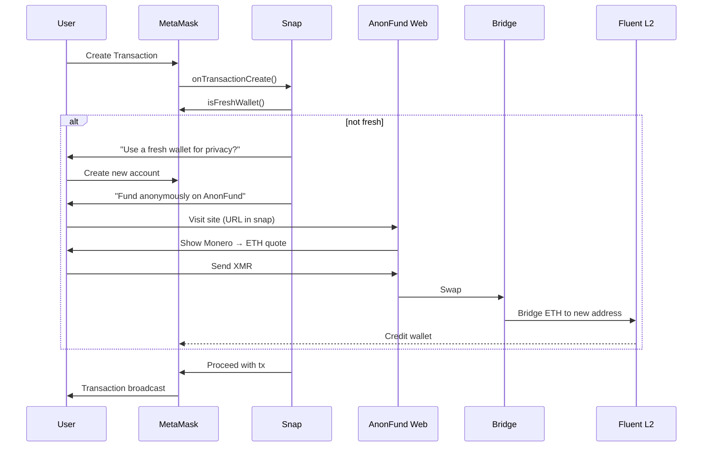

```markdown
# 🦊 AnonFund Snap  
A MetaMask Snap that enforces fresh-wallet hygiene and routes users to a privacy-preserving Monero → ETH on Fluent L2 bridge.

---

## 1-line pitch  
“One click forces a clean wallet and anonymous gas so your on-chain footprint never meets yesterday’s you.”

---

## Features  
| Feature | Description |
|---|---|
| 🧼 Fresh-wallet enforcement | Blocks legacy addresses; prompts for a brand-new MetaMask account |
| 🌀 Native UX | Works inside the MetaMask extension—no external pop-ups until funding |
| 🏴‍☠️ Anonymous gas | Seamless redirect to our XMR → Fluent-ETH bridge |
| 🔒 Zero-knowledge | No logs, no e-mail, no KYC; Monero input → ETH output |
| 🚀 L2 cheap & fast | Recipient wallet is funded on Fluent L2 (sub-cent fees, <30 s) |

---

## User Flow (visual)  


---

## Install & Develop  

### Prerequisites  
- Node ≥ 18  
- MetaMask Flask (developer build)  
- Yarn or npm  

### Quick start  
```bash
git clone https://github.com/AnonFund/snap.git
cd snap
yarn && yarn build
yarn serve        # serves at http://localhost:8080
```

1. Open MetaMask Flask → Settings → Snaps → “Load local snap”  
2. Point to `http://localhost:8080` (manifest + bundle)  
3. Accept permissions: `wallet_getAccounts`, `wallet_createAccount`, `external_website_redirect`

---

## API (Snap RPC surface)  
| Method | Params | Returns | Description |
|---|---|---|---|
| `isfresh_wallet` | `{address: string}` | `{fresh: boolean}` | Checks if address has 0 tx history on ETH mainnet |
| `prompt_new_wallet` | — | `{action: "created" \| "rejected"}` | UI wizard that creates a new MetaMask account |
| `open_funding_portal` | `{address: string}` | `{opened: boolean}` | Opens browser tab prefilled with recipient = new address |

---

## Security Model  
- Runs in the Snap iframe (LavaMoat)  
- No access to private keys  
- Funding site opened via `snap_notify` + user gesture (CSP isolated)  
- All bridge liquidity held in MPC custodial contracts audited by …(link)  

---

## Privacy Guarantee  
1. Monero input is ring-signature protected  
2. Bridge contract uses flash-mint + burn; no mapping between XMR txid and ETH recipient is stored  
3. Frontend is Tor-friendly (onion link in snap)  
4. No analytics, no cookies, no JS fingerprinting  

---

## Config & ENV (self-host)  
```bash
# .env
FLUENT_RPC=https://rpc.fluent.xyz
BRIDGE_API=https://api.anonfund.net
XMR_WALLET_RPC=user:pass@xmr-node:18083
SNAP_ORIGIN=local:http://localhost:8080
```

---

## Testing  
```bash
yarn test:unit
yarn test:integration --mainnet-fork  # spins up anvil + MetaMask flask
```

---

## Build & Publish  
```bash
yarn build:prod
yarn publish:snaps   # uploads to npm + snaps registry
```

---

## Roadmap  
- [ ] BTC → ETH via Silent-Payments  
- [ ] Shielded airdrop eligibility checker  
- [ ] Mobile MetaMask support (once Snaps on mobile)

---

## Support  
💬 Discord: `https://discord.gg/anonfund`  
🐛 Issues: `https://github.com/AnonFund/snap/issues`  
📧 PGP: `0xA1B2C3D4` on keybase

---

## License  
MIT © 2025 AnonFund DAO
```
