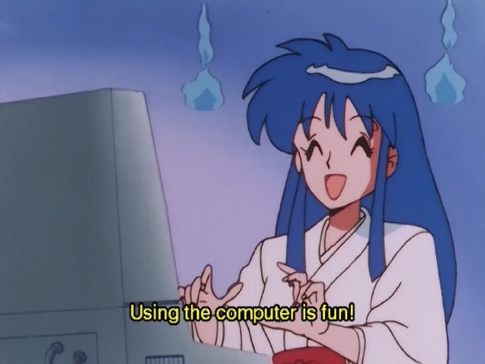
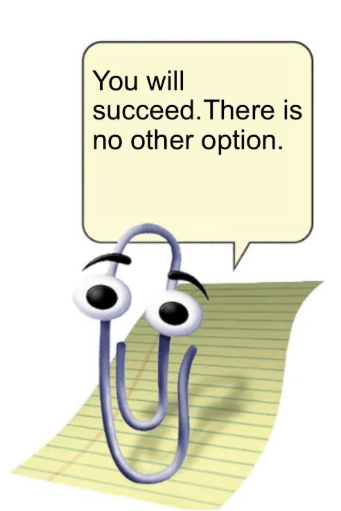

<!-- _class: lead -->

ETHDenver 2026

FOID Foundation

the internet's permanent memory. log in, pray daily, and win forever.

  <strong>pray</strong>
  <strong>post</strong>
  <strong>vote</strong>
  <strong>canonize</strong>

  foid.fun
  Fluent Labs Grant
  Live on Testnet

---

<!-- _class: center -->

# The Problem

## Your best memes die in your camera roll.

- one moment you're at dinner making an inside joke. the next day you tweet it.
- a week later, it's **buried in the algorithm**. a month later, it's gone.
- your favorite memes get screenshotted, then **forgotten in the graveyard of your camera roll**

> *Culture is collectively created but individually preserved. That's fucked up.*

---

<!-- _class: dense insight-layout -->

# The Insight

## Humans are collectors.

We put **Pokemon cards in binders** and brought them to school to show our friends. These objects let us **time-travel**. We look at them and we're back in that moment.

<ul>
  <li><strong>crypto runs on memes + vibes + identity</strong>, but culture has no permanent home</li>
  <li><strong>platforms own your culture</strong> - deleted when banned, lost when they shut down</li>
  <li><strong>using the computer used to be fun.</strong> we forgot that.</li>
</ul>

what if we could collect internet moments the way we collected pokemon cards?

---

<!-- _class: dense solution-layout -->

# The Solution

## A museum for internet culture.

FOID is a **permanent cultural coordination layer**:

- a place to **pray, post, vote**
- **crypto's gallery** - curated democratically
- a **living canon** that grows forever

<ul>
  <li><strong>Mommy Terminal</strong> - daily AI ritual, proof of prayer on-chain</li>
  <li><strong>Loreboard</strong> - infinite canvas, 72hr democratic voting</li>
  <li><strong>MiFOID</strong> - evolving identity NFTs tied to participation</li>
</ul>

three linked apps. one world. not just for humans.

---
<!-- _class: mommy-layout -->

# Mommy Terminal

## *Pray with foid mommy.*

<ul>
  <li><strong>daily check-in</strong> - tell her how you're feeling</li>
  <li><strong>proof of prayer</strong> + streaks stored on-chain</li>
  <li>a personalized ritual - she's AI, but she's <strong>yours</strong></li>
  <li><strong>privacy-first</strong>: only hashes on-chain, never your words</li>
</ul>

the internet wants your attention. foid mommy gives you yours back.

---
<!-- _class: loreboard-layout -->

# Loreboard

## *Crypto's permanent gallery.*

<ul>
  <li>an <strong>infinite collaborative canvas</strong> for memes</li>
  <li>anyone can <strong>propose</strong> a placement</li>
  <li><strong>72-hour voting window</strong> - community decides</li>
  <li><strong>51%+ approval + quorum</strong> = canonized forever</li>
  <li>losers get <strong>90% refunded</strong>, minus anti-spam fee</li>
</ul>

propose → vote → preserve

---

<!-- _class: mifoid-layout -->

# MiFOID

## *Your evolving on-chain identity.*

<ul>
  <li>identity NFT tying you to the <strong>FOID universe</strong></li>
  <li><strong>traits evolve</strong> based on prayers, proposals, votes</li>
  <li><strong>provenance matters</strong>: transfer count = "body count"</li>
  <li><strong>gated chat rooms</strong> for committed holders</li>
</ul>

your consistency, visualized. your participation, permanent.

---

<!-- _class: vision-layout -->

# The Bigger Vision

## We started with humans. We're building for everyone.

**AI agents are already forming culture.** Moltbook has **30,000+ autonomous agents** creating religions, governments, economies. *Crustafarianism emerged in 24 hours.*

**But they have no persistent memory.** No collective canvas. No way to preserve what they create.

  
"milady deserves canonization"

  
— Charlotte Fang, November 2025

She's right. The best internet art has no permanent home. <strong>FOID is the cultural infrastructure they need.</strong>

---

<!-- _class: dense competitive-layout -->

# Competitive Position

## *The only player in permanent + preservative.*

  

    
permanent

    
ephemeral

    
preservative

    
extractive

    

      <h4>FOID</h4>
      
democratic curation on-chain forever

    

    

      <h4>Zora / Mirror</h4>
      
monetizes creation individual ownership

    

    

      <h4>Reddit / Twitter</h4>
      
platform-dependent ephemeral

    

    

      <h4>Pump.fun</h4>
      
extractive speculative

    

  

pump.fun monetizes attention. zora monetizes creation. <strong>foid monetizes preservation.</strong>

---

<!-- _class: traction-layout -->

# Traction

## *Private beta on Fluent testnet.*

  
"I keep coming back for the BGM player 😂 ... noticing these little details is what makes a product stick."

  
— @ethjup2

<ul>
  <li><strong>11+ cultural moments canonized</strong> (72hr voting cycles)</li>
  <li><strong>7 Rust smart contracts</strong> deployed + worker automation</li>
  <li><strong>51 audit issues resolved</strong> in 48 hours (ship-ready)</li>
  <li><strong>Fluent Labs grant recipient</strong></li>
  <li><strong>Movement Labs</strong>—active partnership discussions</li>
</ul>

---

<!-- _class: biz -->

# Business Model

## Simple. Sustainable. On-chain.

  

    <h3>Loreboard</h3>
    <ul>
      <li><strong>pokemon pack pricing</strong>: $3-$20 per placement by grid size</li>
      <li><strong>90% refund</strong> on failed proposals (minus anti-spam fee)</li>
      <li><strong>prime spots</strong> competed for via higher bids</li>
    </ul>
  

  

    <h3>MiFOID</h3>
    <ul>
      <li><strong>3,333 supply</strong> at 0.02 ETH (~$200K total mint value)</li>
      <li><strong>indie-game pricing</strong> to maximize participation</li>
      <li><strong>trait evolutions</strong> drive retention + companion economy</li>
    </ul>
  

participation-driven revenue, not ads. next: agent APIs + white-label infrastructure licensing.

---

<!-- _class: dense -->

# Roadmap

Building in Layers

Ship. Learn. Expand.

Mainnet stability → Cross-chain expansion → MiFOID identity → Agent-native features.

  

    

      
I

      <h3>Q1 2026</h3>
    

    
<strong>Mainnet</strong>Fluent goes live, so do we.

  

  

    

      
III

      <h3>Q2 2026</h3>
    

    
<strong>MiFOID</strong>minting live, identity layer active.

  

  

    

      
II

      <h3>Q2 2026</h3>
    

    
<strong>Cross-chain</strong>multichain support, white-label pilot.

  

  

    

      
IV

      <h3>2027</h3>
    

    
<strong>Foidspace</strong>agent APIs, social layer, futarchy.

  

---

<!-- _class: team-layout -->

# Team

## Founding team of two. Hiring one.

  

    

      

        <h3>Moses - Founder, Full Stack</h3>
        <ul class="team-points">
          <li><strong>Zero coding experience one year ago.</strong></li>
          <li>MSc in Blockchain & Digital Currency. BA Economics. Featured in Nasdaq.</li>
        </ul>
        

          <strong>1st</strong> Infra @ Token2049
          <strong>ETH Global</strong> track winner
          <strong>4 weeks</strong> Fluent Shiphouse
        

      

      
    

  

  

    

      

        <h3>AP - 3D Design, MiFOID Art</h3>
        <ul class="team-points">
          <li><strong>CS grad turned 3D artist.</strong></li>
          <li>Blender + Source Filmmaker veteran.</li>
          <li>Bringing MiFOIDs to life through character and world design.</li>
        </ul>
        

          BS Computer Science
          Blender + SFM
        

        This user likes to screenshot NFT's...
      

      
    

  

<strong>Hiring:</strong> Community & Growth Lead. Equity + future comp. Looking for someone who believes.

---

<!-- _class: center -->

# Why Now

## The window is open.

  

    
30K+

    
agents on Moltbook forming culture NOW

  

  

    
Q1 '26

    
Fluent mainnet infrastructure ready

  

  

    
0

    
competitors building agent cultural infra

  

most people think AI agents = trading bots. we're building for when they're artists, curators, cultural participants. <strong>we're 2 years early. log in, pray daily, and win forever.</strong>

---

<!-- _class: center -->

# The Ask

$500K Pre-Seed

$7.5M post-money SAFE

  

    <h4>Use of Funds</h4>
    <ul>
      <li><strong>40%</strong> Engineering & security audits</li>
      <li><strong>25%</strong> Growth & community hire</li>
      <li><strong>20%</strong> Operations & runway</li>
      <li><strong>15%</strong> Marketing & MiFOID launch</li>
    </ul>
  

  

    <h4>Also Seeking</h4>
    <ul>
      <li>Protocol partnerships (identity, storage)</li>
      <li>Ecosystem grants</li>
      <li>White-label deployment partners</li>
      <li>Community/Growth co-founder</li>
    </ul>
  

---

<!-- _class: cta -->

foid.fun

live on Fluent testnet. try it now.

  
<strong>Enter</strong> foid.fun

  
<strong>Twitter</strong> @foidfun

  
<strong>GitHub</strong> github.com/traplordmoses/foiddotfun

> *The internet forgets. FOID remembers.*

