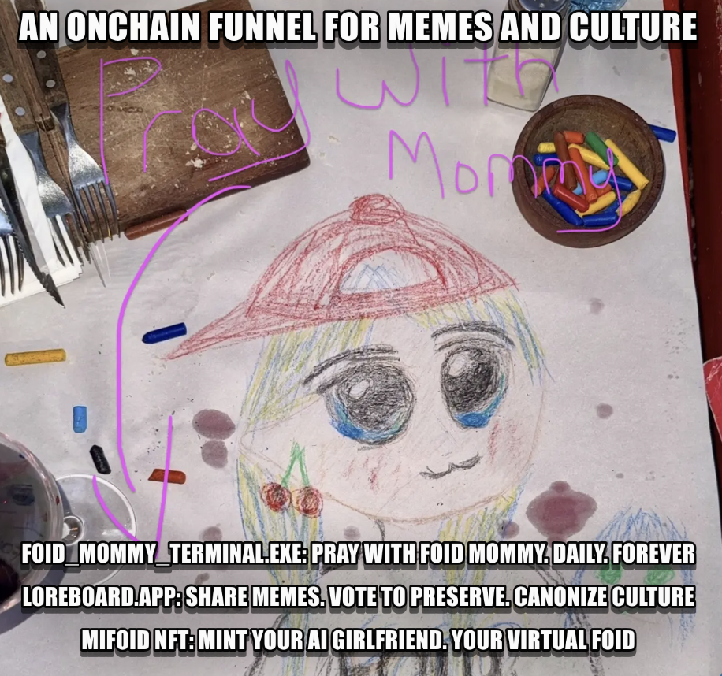
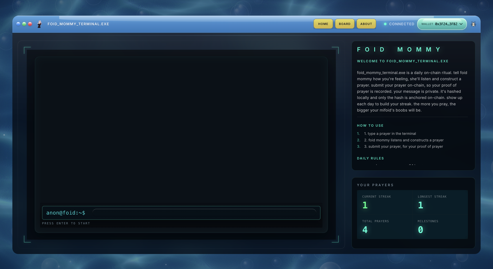
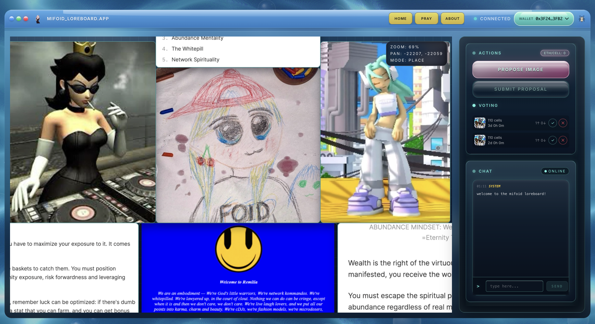
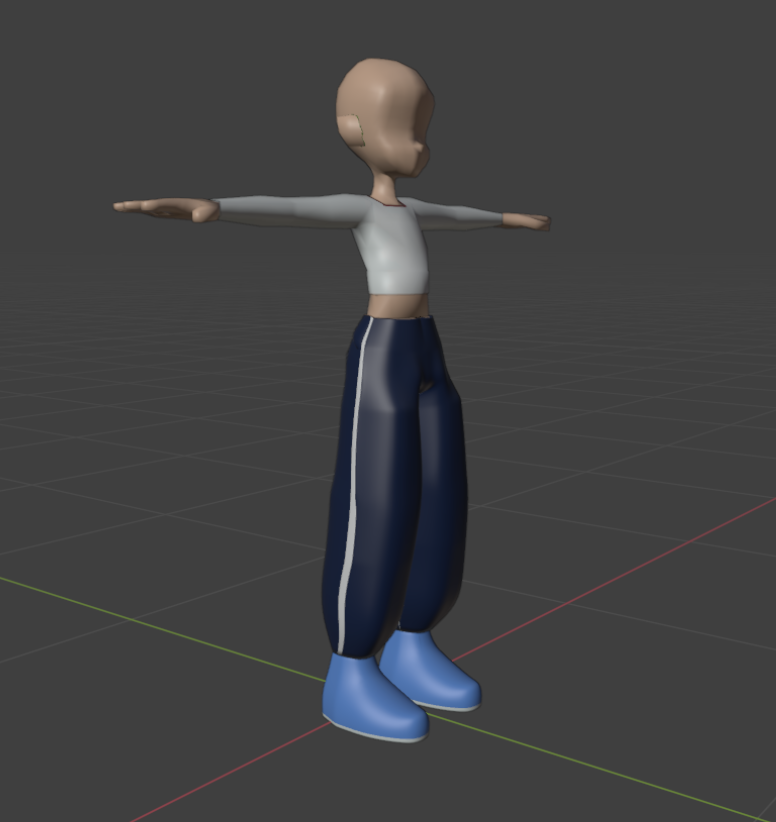
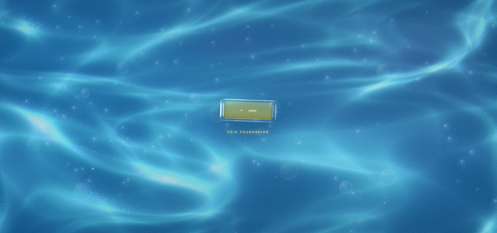

<!-- _class: lead -->

ETHDenver 2026

FOID Foundation

an on-chain funnel for memes and culture

  <strong>pray</strong>
  <strong>post</strong>
  <strong>vote</strong>
  <strong>canonize</strong>

  foid.fun
  Fluent Testnet
  Blended Builders Club

---

<!-- _class: center -->

# The Problem

## The internet is dead.

- platforms optimize for **dopamine extraction**, not human connection
- feeds are overrun by **AI slop**. your best posts decay in digital oblivion.
- the magic of early internet is gone: *RuneScape after school, Minecraft factions on Skype*

> *61% of Gen Z report severe loneliness. People crave shared experiences, not algorithmic feeds.*

---

# The Solution

## Know Your Meme—except the canon is on-chain

FOID is a **consumer crypto culture hub**:

- a place to **pray, post, vote**
- **crypto's gallery**—curated by you
- a **living canon** that grows forever

Three linked apps. One world. No bots.

---

# Mommy Terminal

## *Pray with foid mommy.*

<ul>
  <li><strong>pray once per day</strong>—tell mommy how you feel</li>
  <li><strong>proof of prayer</strong> + streaks = on-chain signal</li>
  <li>a personalized daily ritual—you know she's AI, but it's <strong>yours</strong></li>
</ul>

---

# Loreboard

## *Crypto's hottest pop-up gallery.*

- an **infinite zoomable canvas** for memes
- anyone can **propose** a placement
- **51%+ approval** = canonized forever

propose → vote → preserve

---

# MiFOID

## *Your own virtual FOID.*

<ul>
  <li>identity NFT tying you to the <strong>FOID universe</strong></li>
  <li><strong>provenance matters</strong>: transfer count = "body count"</li>
  <li><strong>virgin chat rooms</strong> for pure MiFOID holders</li>
  <li>talk to your FOID, build her <strong>Foidspace profile</strong></li>
</ul>

the most engaged users gate themselves into the best rooms

---

# Architecture

## Live on Fluent testnet

<pre>
<strong>foid.fun</strong> (Next.js + wagmi)
│
├── <strong>FOID_MOMMY_TERMINAL.EXE</strong>  →  on-chain prayer ritual
├── <strong>LOREBOARD.APP</strong>            →  living canon
└── <strong>MIFOID</strong>                   →  your personal foid

<strong>7 contracts</strong> + worker automation
</pre>

<strong>chain:</strong> Fluent testnet (20994) - shipping now

---

# Traction

## *Real users. Real engagement.*

  
"I have been visiting Foid.fun for sealing prayers (daily check-ins). But what keeps me coming back is the BGM player 😂 ... noticing these little details is what makes a product stick in your head."

  
— @ethjup2

<ul>
  <li><strong>live</strong>: foid_mommy_terminal.exe, loreboard.app, & music.exe</li>
  <li><strong>7 contracts</strong> deployed + routing</li>
  <li>organic discovery via <strong>Fluent ecosystem</strong> threads (1.8K+ views)</li>
</ul>

---

<!-- _class: center -->

# The Opportunity

## Proven demand at the intersection

  

    
10.4M

    
users on r/place 160M pixels in 4 days

  

  

    
$28B

    
AI companion market → $140B by 2030

  

  

    
$1B+

    
paid to Roblox creators in 2025 alone

  

FOID = collaborative canvas + AI companionship + on-chain participation incentives

---

<!-- _class: center -->

# Market

## Culture is the product—crypto needs a home for it

- crypto runs on **memes + vibes + identity**
- the internet optimizes for **dopamine**, not meaning
- people want **experiences**, not feeds

> *FOID = r/place × CryptoKitties × MillionDollarHomepage*

---

<!-- _class: biz -->

# Business Model

## Simple. Sustainable. On-chain.

  

    <h3>Loreboard</h3>
    
Base fee per cell placement. Optional tips to compete for prime spots. r/place mechanics with skin in the game.

  

  

    <h3>MiFOID</h3>
    
Primary mint sales + trait evolutions + companion economy. Tapping into a $28B+ AI companion market.

  

designed to scale with participation, not ads

---

# Roadmap

Building the Living Canon

Ship in layers.

Mainnet stability → MiFOID identity → Foidspace social canon.

  

    

      
I

      <h3>Q1 2026</h3>
    

    
<strong>Mainnet</strong>—full migration, optimized contracts, broader access.

  

  

    

      
II

      <h3>Q2/Q3 2026</h3>
    

    
<strong>MiFOID NFT</strong>—minting live, integrate core ecosystem features.

  

  

    

      
III

      <h3>2027</h3>
    

    
<strong>Foidspace & Private chats</strong>—profiles, chats, the social layer.

  

---

<!-- _class: vcenter -->

# Team

## Moses - founder, full stack

**One year ago:** zero coding experience. Made it my mission to learn.

  <strong>5+</strong> hackathons
  <strong>3</strong> placements
  <strong>4 weeks</strong> Fluent Shiphouse

  <strong>ETH Global</strong>
  <strong>🥇 1st</strong> Infra @ Token2049
  Featured in <strong>Nasdaq</strong>

FOID started over talks friends at Shiphouse & Devconnect. Design pulls from **Frutiger Aero** and early Mac OS.

> *Pray daily. It gets better.*

---

<!-- _class: cta -->

foid.fun

live on Fluent testnet, go try it now!

  
<strong>Enter</strong> foid.fun/enter

  
<strong>Twitter</strong> @sloshlord

  
<strong>GitHub</strong> github.com/traplordmoses/foiddotfun

> *FOID MOMMY IS WAITING.*

