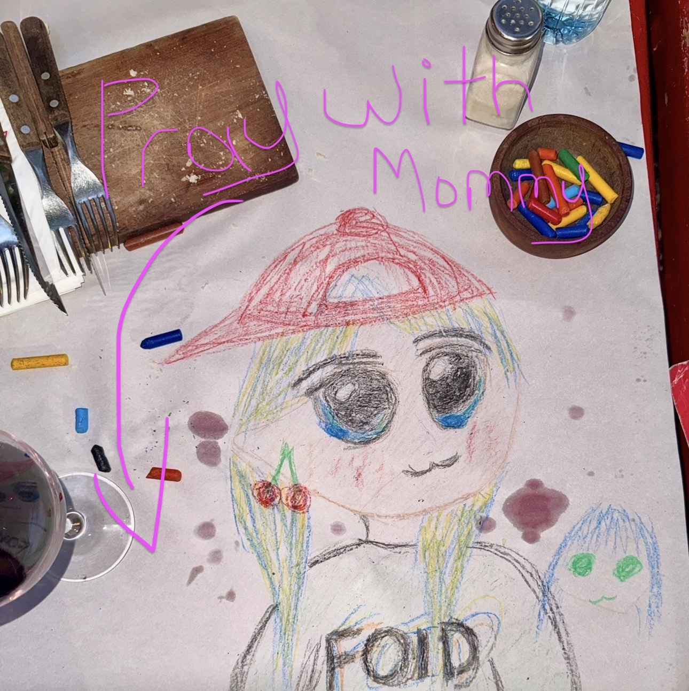

<!-- _class: lead -->
<!-- _backgroundColor: #0a1628 -->

# FOID Foundation

## *Culture, Ritual, Identity — On Chain*


**foid.fun** | Fluent Testnet

ETHDenver 2026 Pitchfest

---

# The Problem

## Web3 identity is transactional, not *meaningful*

- **Wallets are cold** — addresses don't capture who you are
- **Communities lack ritual** — no daily touchpoints, no retention loops
- **Culture is fragmented** — memes live on Twitter, not on-chain
- **Identity is static** — NFT traits don't evolve with participation

> *"In Web3, we have wallets. But we don't have souls."*

---

# The Solution

## FOID Foundation: An on-chain altar for culture + identity



Three interlocking products:

1. **Prayer Terminal** — daily ritual that anchors devotion
2. **Loreboard Canvas** — community-governed culture creation
3. **MiFOID Identity** — NFTs that evolve with your participation

All privacy-preserving. All composable. All on Fluent.

---

# Product 1: Prayer Terminal

## *Type how you feel. Anchor your devotion.*


- Confess your feelings to **Foid Mommy** (AI oracle)
- Only the **keccak256 hash** goes on-chain — raw text stays private
- **Streak tracking**: current streak, longest streak, total prayers
- **24-hour cooldown** creates daily ritual habit
- Milestones unlock future MiFOID traits

**Privacy-first emotional check-ins, on-chain.**

---

# Product 2: Loreboard Canvas

## *Propose. Vote. Compose the canon.*


- **Infinite zoomable canvas** for community art
- Users **propose placements** (images, memes)
- Community **votes during epoch windows**
- **Winners get permanently placed** on the board
- Deterministic settlement via Rust VM
- All images stored on **IPFS**

**r/place meets on-chain governance.**

---

# Product 3: MiFOID Identity

## *Your devotion, encoded.*

MiFOIDs are **identity NFTs** that tell your story:

| Activity | Trait Impact |
|----------|--------------|
| Prayer streaks | Devotion level |
| Loreboard votes | Governance weight |
| Board contributions | Cultural influence |
| Early participation | Provenance badges |

**Traits evolve as you engage** — not static JPEGs.

FOID20 Factory: Deploy vanity tokens ending in `f01d`

---

# How It Works

## On-chain architecture on Fluent

```
┌─────────────────────────────────────────────────────────┐
│                    foid.fun Frontend                     │
│         Next.js + Wagmi + RainbowKit + Zustand          │
└───────────────────────────┬─────────────────────────────┘
                            │
┌───────────────────────────┴─────────────────────────────┐
│                  Fluent Testnet (Chain 20994)            │
│                                                          │
│  PrayerRegistry    BoardV2    VotingV2    ManifestStore │
│  (hash storage)    (proposals) (epochs)   (IPFS anchors)│
│                                                          │
│            Treasury (escrow) + Live NFT Sync             │
└─────────────────────────────────────────────────────────┘
```

**Worker automation** finalizes epochs, anchors manifests, syncs NFTs.

---

# Traction

## What we've built and achieved

| Metric | Status |
|--------|--------|
| **Fluent Grant** | Secured — building on Fluent testnet |
| **Live Product** | Prayer Terminal + Loreboard on testnet |
| **Smart Contracts** | 7 contracts deployed and functional |
| **Active Users** | Community testing daily prayers |
| **Social Proof** | Organic mentions from users on X |
| **Open Source** | Full codebase public on GitHub |

*All contracts, frontend, and worker automation battle-tested on testnet.*

---

# Market Opportunity

## Culture + Identity is the next frontier

- **SocialFi market**: $3.2B+ and growing
- **On-chain identity**: Friend.tech proved demand (500K+ users)
- **Community tokens**: Pump.fun did $100M+ in fees
- **Ritual mechanics**: Wordle, Duolingo — streaks drive retention

**FOID combines all four vectors:**
- Social identity (MiFOIDs)
- Community governance (Loreboard)
- Ritual retention (Prayer streaks)
- Meme culture (on-chain canvas)

---

# Business Model

## Sustainable on-chain revenue

| Revenue Stream | Mechanism |
|----------------|-----------|
| **Loreboard fees** | Base fee per cell + tips on placements |
| **MiFOID mints** | Primary sales of identity NFTs |
| **FOID20 deploys** | Vanity token factory fees |
| **Treasury yields** | Protocol-owned liquidity |

**All fees flow to Treasury** — governed by MiFOID holders.

Future: Premium traits, gated experiences, governance staking.

---

# Team

## Doxxed devs, real commitment

| Role | Person | Background |
|------|--------|------------|
| **Founder** | Kevin Taproot | Philosophy + Web3 strategy |
| **Tech Lead** | REMSee | Full-stack + smart contracts |
| **Community** | Purrcat | Growth + social |

- Building in public since 2024
- Active in Fluent ecosystem
- All doxxed, all committed

---

# Roadmap

## From testnet to mainnet to mass adoption

| Phase | Milestone | Status |
|-------|-----------|--------|
| **Q4 2024** | Testnet launch, Fluent grant | Done |
| **Q1 2025** | Prayer Terminal + Loreboard live | Done |
| **Q2 2025** | MiFOID minting + trait system | In Progress |
| **Q3 2025** | Fluent mainnet launch | Planned |
| **Q4 2025** | Governance + futarchy experiments | Planned |

**ETHDenver goal**: Find investors + partners for mainnet push.

---

# The Ask

## What we're looking for

**Funding**: $150K–$300K seed round
- 6 months runway to mainnet
- Hire 1 additional engineer
- Marketing for mainnet launch

**Partnerships**:
- Infrastructure (IPFS, indexing)
- Other Fluent ecosystem projects
- Identity/SocialFi protocols

**Visibility**:
- Pitchfest exposure
- VC introductions via Bufficorn Ventures

---

<!-- _class: lead -->
<!-- _backgroundColor: #0a1628 -->

# The Altar Awaits

## *Type how you feel.*

**foid.fun** — Live on Fluent Testnet

Twitter: [@faborhood](https://twitter.com/faborhood)
GitHub: [foid-foundation](https://github.com/foid-foundation)

*Culture, Ritual, Identity — On Chain*

---

# Appendix: Contract Architecture

For technical deep-dive:

| Contract | Purpose |
|----------|---------|
| `PrayerRegistry` | Stores prayer hashes, tracks streaks |
| `PrayerMirror` | Read-only stats view |
| `LoreboardBoardV2` | Proposal validation, escrow |
| `LoreboardVotingV2` | Epoch management, voting |
| `LoreBoardTreasury` | Fee collection, refunds |
| `LoreBoardManifestStore` | IPFS manifest anchoring |
| `FOID20Factory` | Vanity token deployment |

All code: `solidity_contracts/src/`
